# Organization Chart

**Click any role** to view its guide. Filled roles show the current holder. Dashed borders indicate vacant positions.

```mermaid
flowchart LR
    charter["Charter Organization"]:::charter
    cor["Charter Org Rep"]:::core
    cc["Committee Chair"]:::core
    cm["Cubmaster"]:::core
    charter --> cor
    cor --> cc
    cc --> cm

    %% Secretary branch
    sec["Secretary"]:::filled
    cc --> sec
    medical["Medical Forms Coordinator"]:::vacant
    sec --> medical
    webmaster["Webmaster"]:::vacant
    sec --> webmaster

    %% Treasurer branch
    tres["Treasurer"]:::filled
    cc --> tres
    ap["Accounts Payable Coordinator"]:::vacant
    tres --> ap
    ar["Accounts Receivable Coordinator"]:::vacant
    tres --> ar

    %% Fundraising branch
    fund["Fundraising Chair"]:::vacant
    cc --> fund
    popcorn["Popcorn Coordinator"]:::filled
    fund --> popcorn
    apopcorn["Asst. Popcorn Coordinator"]:::vacant
    popcorn --> apopcorn
    redeem["Redemptions Coordinator"]:::vacant
    fund --> redeem
    grants["Grants Coordinator"]:::vacant
    fund --> grants

    %% Membership branch
    memb["Membership Chair"]:::vacant
    cc --> memb
    recruit["Member Recruitment"]:::vacant
    memb --> recruit
    onboard["Member Onboarding"]:::vacant
    memb --> onboard
    experience["Member Experience"]:::vacant
    memb --> experience
    apparel["Apparel Coordinator"]:::vacant
    memb --> apparel
    pr["Public Relations"]:::vacant
    memb --> pr

    %% Program branch
    prog["Program Chair"]:::vacant
    cc --> prog
    pinewood["Pinewood Derby"]:::vacant
    prog --> pinewood
    wintercamp["Winter Camping"]:::vacant
    prog --> wintercamp
    springcamp["Spring Camping"]:::vacant
    prog --> springcamp
    fallcamp["Fall Camping"]:::vacant
    prog --> fallcamp
    summercamp["Summer Camping"]:::vacant
    prog --> summercamp
    packactivity["Pack Mtg Activities"]:::filled
    prog --> packactivity
    snack["Pack Mtg Snackmaster"]:::vacant
    prog --> snack
    equip["Equipment Coordinator"]:::vacant
    prog --> equip
    service["Community Service"]:::vacant
    prog --> service
    council["Council Activities"]:::vacant
    prog --> council
    packmisc["Pack Activities"]:::vacant
    prog --> packmisc

    %% Advancement branch
    adv["Advancement Chair"]:::vacant
    cc --> adv
    awards["Scout Awards"]:::filled
    adv --> awards
    bluegold["Blue and Gold"]:::vacant
    adv --> bluegold
    aol["AOL Crossover"]:::vacant
    adv --> aol
    training["Leader Training and Awards"]:::vacant
    adv --> training

    %% Assistant Cubmasters branch
    acm["Assistant Cubmasters"]:::filled
    cm --> acm
    acm_den["ACM Den Support"]:::vacant
    acm --> acm_den
    acm_family["ACM Family Support"]:::vacant
    acm --> acm_family
    acm_engage["ACM Engagement"]:::vacant
    acm --> acm_engage
    acm_meet["ACM Meetings"]:::vacant
    acm --> acm_meet
    acm_hike["ACM Hiking"]:::vacant
    acm --> acm_hike
    acm_crafts["ACM Crafts"]:::vacant
    acm --> acm_crafts
    acm_food["ACM Food"]:::filled
    acm --> acm_food
    acm_comms["ACM Communications"]:::vacant
    acm --> acm_comms

    %% Den Leaders branch
    dl["Den Leaders"]:::filled
    cm --> dl
    dl_lions["Lions Den 7"]:::filled
    dl --> dl_lions
    dl_tigers["Tigers Den 1"]:::filled
    dl --> dl_tigers
    dl_wolves["Wolves Den 2"]:::filled
    dl --> dl_wolves
    dl_bears["Bears Den 3"]:::filled
    dl --> dl_bears
    dl_webelos["Webelos Den 4"]:::filled
    dl --> dl_webelos
    dl_aol["Arrow of Light Den 5"]:::filled
    dl --> dl_aol

    %% Den support roles (under Den Leaders)
    adl["Assistant Den Leader"]:::vacant
    dl --> adl
    dc["Den Chief"]:::filled
    dl --> dc

    %% Click handlers
    click cor "/roles/charter-org-rep/"
    click cc "/roles/committee-chair/"
    click cm "/roles/cubmaster/"
    click sec "/roles/secretary/"
    click medical "/roles/secretary/medical-forms-coordinator"
    click webmaster "/roles/secretary/webmaster"
    click tres "/roles/treasurer/"
    click ap "/roles/treasurer/accounts-payable-coordinator"
    click ar "/roles/treasurer/accounts-receivable-coordinator"
    click fund "/roles/fundraising-chair/"
    click popcorn "/roles/fundraising-chair/popcorn-coordinator/"
    click apopcorn "/roles/fundraising-chair/popcorn-coordinator/assistant-popcorn-coordinator"
    click redeem "/roles/fundraising-chair/redemptions-coordinator"
    click grants "/roles/fundraising-chair/grants-coordinator"
    click memb "/roles/membership-chair/"
    click recruit "/roles/membership-chair/member-recruitment-coordinator"
    click onboard "/roles/membership-chair/member-onboarding-coordinator"
    click experience "/roles/membership-chair/member-experience-coordinator"
    click apparel "/roles/membership-chair/apparel-coordinator"
    click pr "/roles/membership-chair/public-relations-coordinator"
    click prog "/roles/program-chair/"
    click pinewood "/roles/program-chair/pinewood-derby-coordinator"
    click wintercamp "/roles/program-chair/winter-camping-coordinator"
    click springcamp "/roles/program-chair/spring-camping-coordinator"
    click fallcamp "/roles/program-chair/fall-camping-coordinator"
    click summercamp "/roles/program-chair/summer-camping-coordinator"
    click packactivity "/roles/program-chair/pack-meeting-activity-coordinator"
    click snack "/roles/program-chair/pack-meeting-snackmaster"
    click equip "/roles/program-chair/equipment-coordinator"
    click service "/roles/program-chair/community-service-coordinator"
    click council "/roles/program-chair/misc-council-activities-coordinator"
    click packmisc "/roles/program-chair/misc-pack-activities-coordinator"
    click adv "/roles/advancement-chair/"
    click awards "/roles/advancement-chair/awards-coordinator"
    click bluegold "/roles/advancement-chair/blue-and-gold-coordinator"
    click aol "/roles/advancement-chair/aol-crossover-coordinator"
    click training "/roles/advancement-chair/leader-training-coordinator"
    click acm "/roles/assistant-cubmaster/"
    click acm_den "/roles/assistant-cubmaster/den-support"
    click acm_family "/roles/assistant-cubmaster/family-support"
    click acm_engage "/roles/assistant-cubmaster/engagement"
    click acm_meet "/roles/assistant-cubmaster/meetings"
    click acm_hike "/roles/assistant-cubmaster/hiking"
    click acm_crafts "/roles/assistant-cubmaster/crafts"
    click acm_food "/roles/assistant-cubmaster/food"
    click acm_comms "/roles/assistant-cubmaster/communications"
    click dl "/roles/den-leader/"
    click dl_lions "/roles/den-leader/"
    click dl_tigers "/roles/den-leader/"
    click dl_wolves "/roles/den-leader/"
    click dl_bears "/roles/den-leader/"
    click dl_webelos "/roles/den-leader/"
    click dl_aol "/roles/den-leader/"
    click adl "/roles/den-leader/assistant-den-leader"
    click dc "/roles/den-chief/"

    classDef charter fill:#fff3e0,stroke:#e65100,stroke-width:2px,color:#e65100
    classDef core fill:#c8e6c9,stroke:#1b5e20,stroke-width:3px,color:#1b5e20
    classDef filled fill:#c8e6c9,stroke:#1b5e20,stroke-width:2px,color:#1b5e20
    classDef vacant fill:#f5f5f5,stroke:#999,stroke-width:2px,stroke-dasharray: 5 5,color:#666
```

---

See the [full roles directory](roles/) for detailed guides and coordinator pages.
